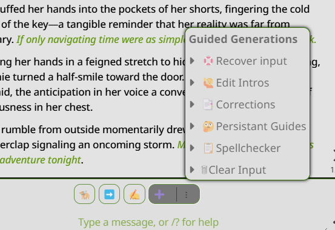
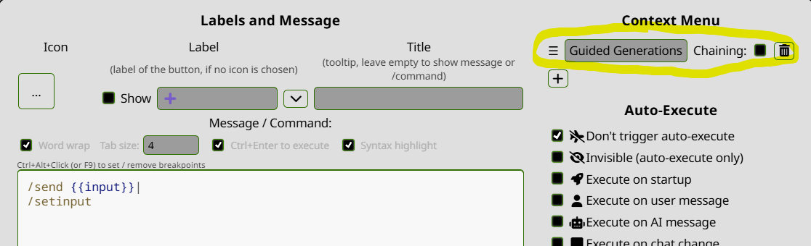

# Guided Generations Quick Reply Set for SillyTavern

This repository provides a specialized Quick Reply set for [SillyTavern](https://github.com/SillyTavern/SillyTavern), designed to enhance and refine roleplay and chat interactions with language models. The Quick Replies allow you to dynamically create, modify, and manage guided instructions for shaping responses, correcting outputs, and maintaining in-world consistency across your conversations.

---

## Table of Contents

- [Features and Usage Guide](#features-and-usage-guide)
  - [🦮 Guided Next Response](#-guided-next-response)
  - [✍️ Guided Impersonation](#-guided-impersonation)
  - [🤔 Persistent Guides](#-persistent-guides)
  - [📑 Corrections & Refinements](#-corrections--refinements)
  - [📋 Spellchecker & Flow Enhancer](#-spellchecker--flow-enhancer)
- [Additional Utility Quick Replies](#additional-utility-quick-replies)
  - [➕ Add Reply Without Triggering a Response](#-add-reply-without-triggering-a-response)
  - [🙋 Edit Intros](#-edit-intros)
  - [🛟 Recover Input](#-recover-input)
  - [🗑 Clear Input](#-clear-input)
  - [⚙️ Automatic Contextual Updates](#️-automatic-contextual-updates)
- [Installation](#installation)
- [Troubleshooting](#troubleshooting)
- [License](#license)
- [Contributing](#contributing)

---

## Features and Usage Guide

Each feature is accessed by pressing a **button** with the corresponding emoji. Before selecting a button, ensure you input any necessary instructions into the input field. These Quick Replies are designed to be flexible and modular; feel free to experiment to find what works best for your narrative style.

[Watch the Demo for the Basic Functions](https://youtu.be/16-vO6FGQuw)
---

### 🦮 Guided Next Response
Provide precise instructions for the assistant’s next response. Useful for guiding tone, style, or specific content.

**How to Use:**  
- Type your guidance into the input field (e.g., *"Describe the scene with a melancholic tone."*).
- Press the **🦮** button to execute the Quick Reply.

**For Refinement:**  
- Use the **➡️** button to retry or refine the bot’s response based on updated guidance.

---

### ✍️ Guided Impersonation
Transform rough outlines or partial ideas into rich, detailed narratives. Ideal for first-person perspectives (or another viewpoint if adjusted).

**How to Use:**  
- Type a brief outline into the input field (e.g., *"Describe how you negotiate with the alien diplomat, keeping your cool but emphasizing urgency."*).
- Press the **✍️** button to execute the Quick Reply.
- The assistant will expand your outline into a polished narrative.

---

### 🤔 Persistent Guides
Set, modify, and maintain scenario rules or contextual instructions that persist throughout your roleplay. These ensure consistency in character behavior, environmental details, and scene dynamics.

**Sub-Menu Options:**

- **Situational Guides (CoT Light):**  
  Generates a concise list of relevant details from recent chat history, helping maintain scenario accuracy.

- **Thinking:**  
  Produces characters’ internal thought processes for added depth.  
  *Tip:* If the invisible **SysThinking** Quick Reply is set to run on user messages, it updates characters’ thoughts automatically after each input and before guided generation.

- **Clothes and State:**  
  Retrieves details about characters’ attire, state, and positions.  
  *Tip:* If the invisible **SysClothes** Quick Reply is set to run on user messages, it keeps the scene’s physical continuity current.

- **Rules:**  
  Creates or updates a list of in-story rules or expectations, ensuring consistent behavior and adherence to established norms.

- **Custom Guide:**  
  Lets you create and store custom guides for special contexts or character behaviors.

- **Edit Guides:**  
  Update existing guides without starting over. Perfect for refining details as your story evolves.

- **Show Guides:**  
  Displays all active guides for review, making it easy to recall current constraints.

- **Flush Guides:**  
  Removes one or all active guides, resetting the context as needed.

---

### 📑 Corrections & Refinements
Refine the assistant’s last response with targeted edits.

**How to Use:**  
- Input specific corrections into the input field (e.g., *"Make it more formal and add a reference to the ancient prophecy."*).
- Press the **📑** button to apply the corrections.

---

### 📋 Spellchecker & Flow Enhancer
Improve grammar, punctuation, and flow before sending text to the model.

**How to Use:**  
- Enter your text into the input field.
- Press the **📋** button to polish your input.

---

## Additional Utility Quick Replies

### ➕ Add Reply Without Triggering a Response
Allows you to send a user message to the chat without prompting a new assistant reply. This is useful for adding commentary, notes, or scene descriptions. Additionally, by opening its context menu, you can access the guided addons directly.

**How to Use:**  
- Type your message into the input field.
- Press the **➕** button to send it to the chat without requesting a response from the model.
- Right-click or open the context menu on the **➕** button (depending on your interface) to access the guided addons.

---

### 🙋 Edit Intros

**Purpose:**  
Rewrite or transform introductory messages dynamically. If no instructions are in the input field, you’ll be offered a menu to alter perspective, tense, style, or character pronouns.

**How to Use:**  
- If you have a specific request, type it in first (e.g., *"Convert the intro to a more poetic style."*) and press **🙋**.  
- If the input field is empty, pressing **🙋** displays a menu of transformations. Make a selection, and the currently displayed intro will be rewritten accordingly and added to the other intros as a new swipe.

---

### 🛟 Recover Input
Restores previously typed text that you cleared from the input field. Ideal if you accidentally wiped content you wanted to keep.

**How to Use:**  
- Press the **🛟** button to restore the most recently cleared input.

---

### 🗑 Clear Input
Quickly clears the input field if you decide you don’t want to send the current text.

**How to Use:**  
- Press the **🗑** button to empty the input field.

---

### ⚙️ Automatic Contextual Updates
By enabling **SysClothes** and **SysThinking** Quick Replies to execute on user messages, you ensure automatic updates between your inputs and the assistant’s responses. This maintains a dynamic, context-aware narrative flow.

**Note:**  
These updates trigger only on user messages, not on swipes, which reuse existing context.

---

## Installation

1. **Download the JSON file:**   
   - `Guided Generations.json`

2. **Install LALib:**  
   - Install the [LALib library extension](https://github.com/LenAnderson/SillyTavern-LALib).

3. **Import into SillyTavern:**  
   - Open SillyTavern, go to **Settings > Quick Replies**, and import the `.json` files.  
   - Add Guided Generatins under the Global or Chat Quick Reply Sets.

**Compatibility:**  
Ensure you’re using a compatible version of SillyTavern. If you encounter issues, consider updating or checking the SillyTavern documentation.

---

## Troubleshooting

1. **I get Errormessages:**   
   - SillyTavern needs to be atleast version (1.12.9)
   - Redownload [LALib library extension](https://github.com/LenAnderson/SillyTavern-LALib) and make sure it is activated in the Extensions

2. **I have only 4 Symbols:**  
   - You should have a Context Menus on the ➕ that you can open with long press or right click.
     
     
3. **Contex menus is missing:**
   - If the context menu is missing, then open quick replies, press the button with three stacked dots next to the ➕ script,  
then add, or delete and re-add guided generations as a context menu in the top right.
   

**Compatibility:**  
Ensure you’re using a compatible version of SillyTavern. If you encounter issues, consider updating or checking the SillyTavern documentation.

---

## License

This project is licensed under the GNU General Public License v3.0. See the [LICENSE](LICENSE) file for details.

---

## Contributing

Contributions are welcome! If you’d like to propose improvements, create new features, or enhance the documentation, please submit a pull request or open an issue.

**Support & Feedback:**  
For questions, feedback, or bug reports, open an issue in this repository. Your input helps improve this project for everyone.

---

Let me know if you’d like further refinements!
